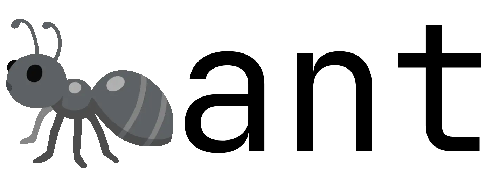
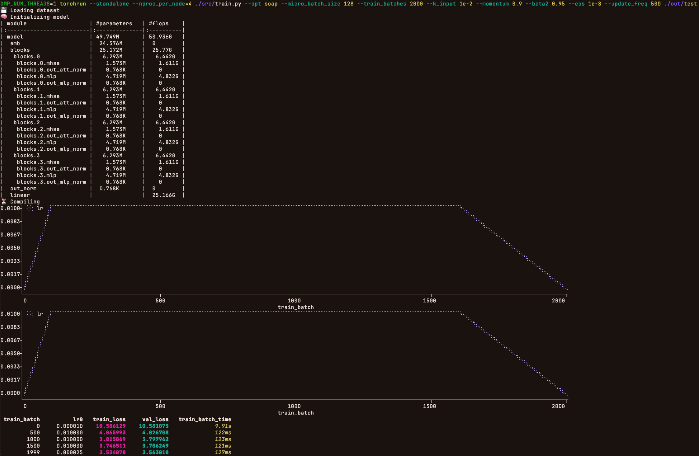
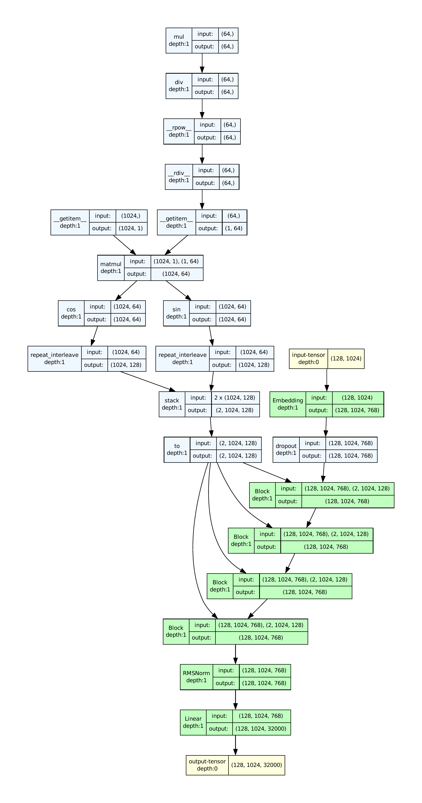
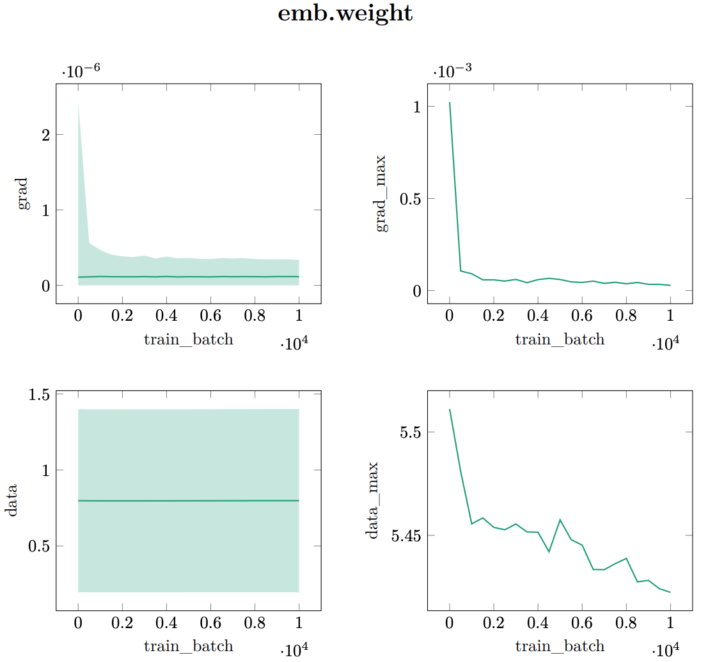
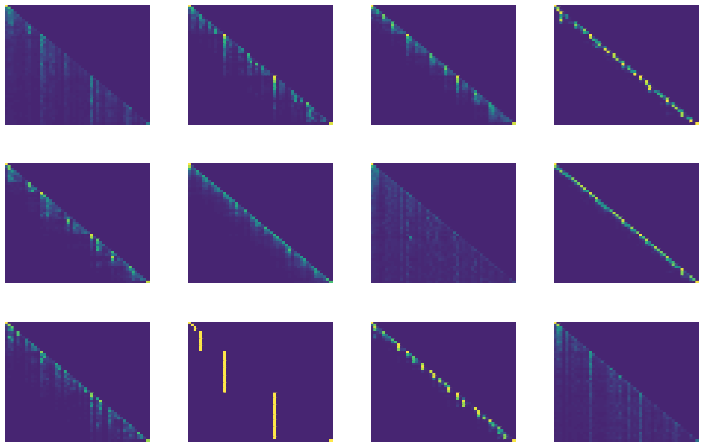

<picture>
  <source srcset="./res/dynamic_dark.webp" media="(prefers-color-scheme: dark)">
  
</picture>

## Description
ant is a PyTorch-based Deep Learning framework. It is inspired by [nanoGPT](https://github.com/karpathy/nanoGPT), although it does not borrow code from it. It tries to keep being research-friendly, while integrating (way) more features, following modern best practices and being modular. Specifically, among others, ant supports:
1) The CIFAR-10, OpenWebText, FineWeb-Edu and [ClimbMix](https://huggingface.co/datasets/nvidia/ClimbMix) (SoTA) datasets
2) Any Hugging Face or TokenMonster (SoTA) tokenizer
3) ResNet, GPT2, Llama 2, nGPT, and OLMo 2 models
4) The PSGD, DistributedShampoo, AdEMAMix, SOAP, Muon and Scion optimizers
5) [μP](https://www.microsoft.com/en-us/research/blog/%C2%B5transfer-a-technique-for-hyperparameter-tuning-of-enormous-neural-networks/) for zero-shot hyperparameter transfer
6) Downstream evaluations (HellaSwag, ARC etc.) through lm_eval during training
7) Model summary (parameters and FLOPS) and computational graph visualization
8) Offline logging of gradients and weights in simple .dat files
9) Attention heatmaps
10) Plotting through PGFPlots
11) Distributed Data Parallel, torch.compile and Automatic Mixed Precision

## Getting Started
